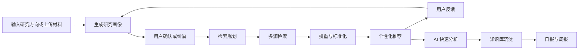
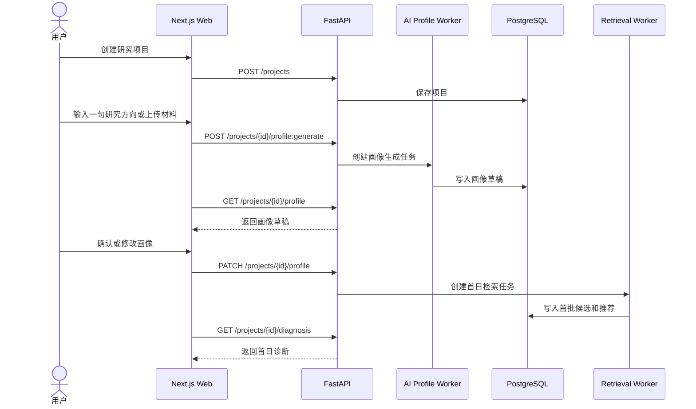
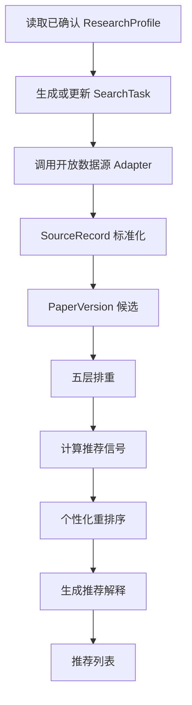
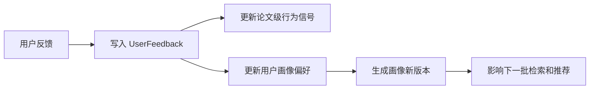
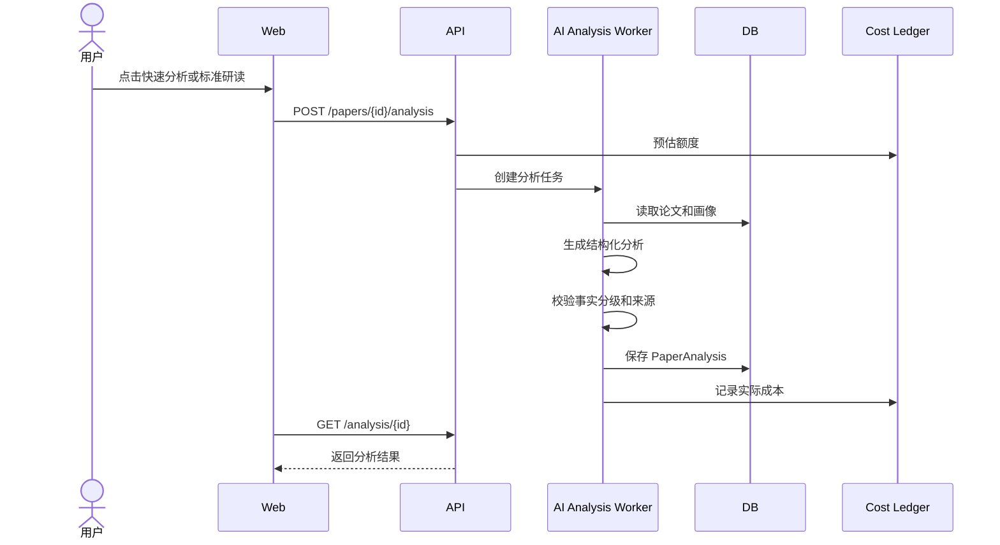
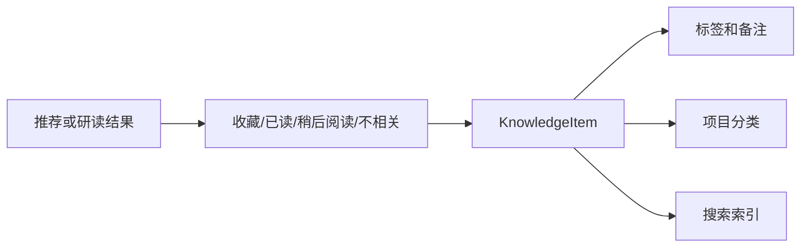
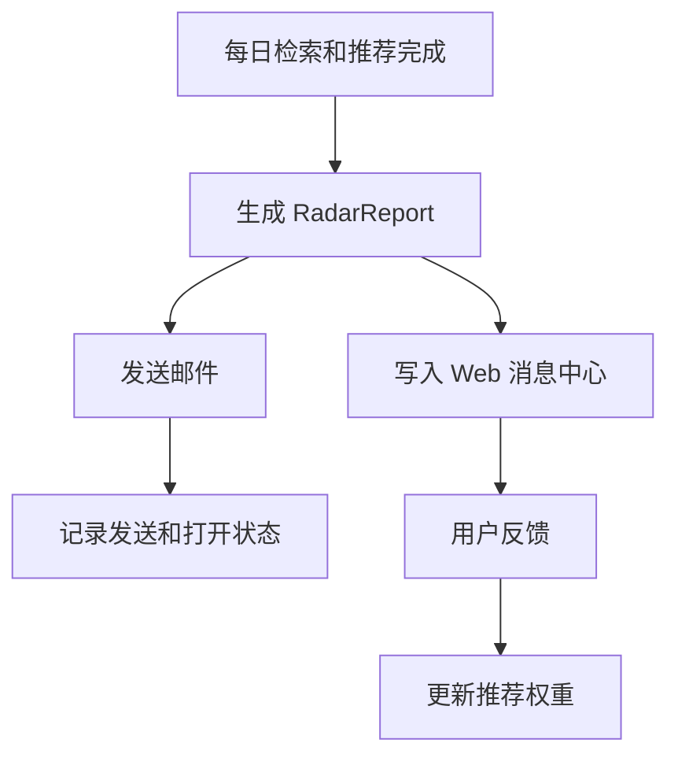

# 03 用户流程

版本：v0.1  
日期：2026-06-14  
状态：MVP 基线

## 1. 流程总览

MVP 用户体验围绕一个主循环：

关联需求：`RR-MVP-003` 至 `RR-MVP-029`。

## 2. 冷启动流程

覆盖需求：`RR-MVP-002`、`RR-MVP-003`、`RR-MVP-004`、`RR-MVP-005`、`RR-MVP-006`、`RR-MVP-007`、`RR-MVP-008`。

关键体验要求：

- 用户不应先面对复杂问卷。
- 输入一句研究方向即可启动。
- 系统必须在首日返回可见结果，而不是等待第二天。
- 画像必须可编辑，不允许把 AI 判断变成不可修改结论。

失败处理：

- 如果 AI 画像失败，保留用户输入并允许重试。
- 如果数据源暂不可用，返回已有关键词和待执行任务状态。
- 如果首批推荐不足，明确说明数据不足并给出补充基石论文建议。

## 3. 每日推荐流程

覆盖需求：`RR-MVP-009`、`RR-MVP-010`、`RR-MVP-011`、`RR-MVP-012`、`RR-MVP-013`、`RR-MVP-014`、`RR-MVP-016`、`RR-MVP-017`。

推荐列表展示字段：

- 中文题名。
- 原文题名。
- 作者和年份。
- 期刊或来源。
- DOI 或来源链接。
- 推荐等级。
- 推荐原因。
- 命中关键词和语义信号。
- 开放全文状态。
- 操作按钮：收藏、稍后阅读、不相关、方法可借鉴、标准研读。

失败处理：

- 某个数据源失败时，其他数据源继续运行。
- 单篇论文 AI 分析失败时，不影响推荐列表展示。
- 排重置信度不足时，保留候选并标记人工复核。

## 4. 反馈纠偏流程

覆盖需求：`RR-MVP-018`、`RR-MVP-019`。

反馈类型：

- 非常相关。
- 方法可借鉴。
- 适合背景引用。
- 与方向无关。
- 不关注这种材料。
- 不关注这种应用。
- 希望增加此类论文。
- 加入实验计划。
- 加入写作证据库。

纠偏控制台必须展示：

- 当前重点：对象、方法、材料、机理、性能、应用。
- 当前扩展范围：上位概念、相似材料、可迁移方法、相关学科。
- 当前排除范围：用户明确不关注的材料、应用、方法或时间范围。
- 快捷调节：少推荐某类应用、增加方法论文、增加综述、只看近三年、增加高被引基础论文、只看可获取全文、扩大或缩小材料范围。

## 5. AI 研读流程

覆盖需求：`RR-MVP-020`、`RR-MVP-021`、`RR-MVP-022`、`RR-MVP-030`、`RR-MVP-031`、`RR-MVP-035`。

快速分析输出：

- 中文题名。
- 一句话结论。
- 中文摘要。
- 相关原因。
- 推荐等级。
- 是否值得深读。

标准研读输出：

- 文献信息。
- 研究背景。
- 研究问题。
- 研究对象。
- 研究方法。
- 核心结果。
- 创新点。
- 局限性。
- 与用户课题共同点。
- 可借鉴内容。
- 不适用内容。
- 下一步阅读建议。

每条关键结论必须带事实分级：

- 原文明确说明。
- AI 归纳。
- 多文献对比。
- AI 推测。
- 研究启发。

## 6. 知识库流程

覆盖需求：`RR-MVP-023`、`RR-MVP-024`、`RR-MVP-025`。

MVP 知识库页面：

- 我的研究项目。
- 收藏论文。
- 稍后阅读。
- 已读论文。
- 不相关论文。
- 标签筛选。
- 搜索。
- 论文分析报告。

MVP 不实现：

- 复杂 Wiki 编辑。
- 完整知识图谱。
- 冲突结论库。
- 参数数据库。

## 7. 推送流程

覆盖需求：`RR-MVP-026`、`RR-MVP-027`、`RR-MVP-028`、`RR-MVP-029`。

日报必须包含：

- 今日新论文数。
- 排重后数量。
- 高相关论文。
- 建议深读论文。
- 方法启发论文。
- 核心作者动态。

周报必须包含：

- 本周高价值论文。
- 热点变化。
- 新方法。
- 知识库增长。
- 待阅读论文。
- 下周建议。

