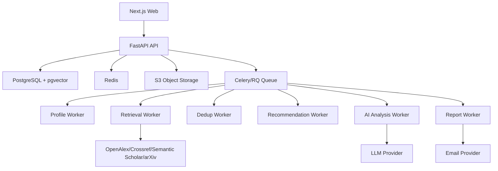
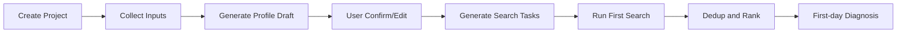
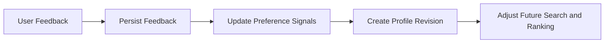

# 04 技术架构

版本：v0.1  
日期：2026-06-14  
状态：MVP 基线

## 1. 架构目标

MVP 架构必须服务于推荐准确闭环，而不是追求过早复杂化。

目标：

- 支持一句话冷启动、研究画像、检索、排重、推荐、反馈和推送闭环。
- AI 分析和确定性任务分离。
- 每个任务可重试、可审计、可记录成本。
- 开放数据源适配器可插拔。
- 后续可平滑扩展到全文研读、知识图谱、浏览器扩展和机构版本。

## 2. 技术栈

默认技术选型：

- 前端：Next.js。
- 后端：Python FastAPI。
- 数据库：PostgreSQL。
- 向量检索：pgvector。
- 缓存、限流、任务状态缓存：Redis。
- 对象存储：S3 兼容存储。
- 异步任务：Celery 或 RQ。
- 邮件：SMTP 或事务邮件服务。
- 日志：结构化 JSON 日志。
- 后期工作流：Temporal。

## 3. 系统边界

## 4. 服务模块

| 模块 | 职责 | 关联需求 |
| --- | --- | --- |
| Identity | 注册、登录、会话、权限 | `RR-MVP-001` |
| Project | 研究项目管理 | `RR-MVP-002` |
| Profile | 研究画像生成、确认、版本管理 | `RR-MVP-003` 至 `RR-MVP-008` |
| Source Adapter | 开放数据源接入、限流、缓存、重试 | `RR-MVP-010` |
| Retrieval | 检索规划、定时检索、过滤 | `RR-MVP-009` 至 `RR-MVP-012` |
| Paper Normalize | 元数据标准化、版本合并候选 | `RR-MVP-013` |
| Dedup | 五层排重、主文献实体维护 | `RR-MVP-014` |
| FullText Discovery | 开放全文状态识别 | `RR-MVP-015` |
| Recommendation | 个性化评分、排序、解释 | `RR-MVP-016`、`RR-MVP-017` |
| Feedback | 用户反馈、纠偏、偏好写回 | `RR-MVP-018`、`RR-MVP-019` |
| AI Analysis | 快速分析、标准研读、事实分级 | `RR-MVP-020` 至 `RR-MVP-022`、`RR-MVP-035` |
| Knowledge | 收藏、状态、标签、搜索 | `RR-MVP-023` 至 `RR-MVP-025` |
| Report | 日报、周报、站内消息、邮件 | `RR-MVP-026` 至 `RR-MVP-029` |
| Cost | 成本记录、额度、后台统计 | `RR-MVP-030` 至 `RR-MVP-032` |
| Audit | 审计日志、任务失败降级 | `RR-MVP-033`、`RR-MVP-034` |

## 5. 工作流

### 5.1 冷启动工作流

要求：

- `Generate Profile Draft` 必须输出结构化 JSON，并通过 schema 校验。
- 用户确认画像后才能作为正式推荐依据。
- 首日检索可降级为使用已有开放数据源结果，但必须给出任务状态。

### 5.2 每日推荐工作流

要求：

- 数据源调用必须有超时、重试、限流和熔断。
- 排重不能丢失来源记录。
- 推荐必须保存分数、理由和使用的画像版本。

### 5.3 反馈写回工作流

要求：

- 反馈写回必须是可解释的。
- 不允许单次反馈剧烈改变全部推荐。
- 用户可在纠偏控制台查看当前偏好。

## 6. 存储策略

### 6.1 PostgreSQL

存储：

- 用户、项目、研究画像。
- 文献主实体和版本。
- 来源记录。
- 检索任务。
- 推荐、反馈、分析报告。
- 知识库状态。
- 成本和审计日志。

### 6.2 pgvector

存储：

- 研究画像 embedding。
- 论文标题摘要 embedding。
- 用户材料片段 embedding。
- 分析报告片段 embedding。

### 6.3 Redis

用途：

- API 限流。
- 任务状态缓存。
- 数据源熔断状态。
- 短期检索结果缓存。
- 幂等键。

### 6.4 S3 兼容对象存储

存储：

- 用户上传的基石论文。
- 研究材料原文件。
- 解析后的文本文件。
- 可缓存的开放全文文件。

对象存储必须记录：

- 上传用户。
- 所属项目。
- 文件哈希。
- 文件类型。
- 解析状态。
- 删除状态。

## 7. 成本控制

关联需求：`RR-MVP-030`、`RR-MVP-031`、`RR-MVP-032`。

成本控制规则：

- 先规则和检索，后 AI。
- 先标题摘要快速分析，后全文深读。
- 同一篇论文的公共解析结果可复用。
- 个性化分析独立记录成本。
- 每次模型调用必须记录模型、输入 token、输出 token、耗时、用户、项目、任务和功能。
- 高成本任务必须检查用户额度。

MVP 成本上限默认值：

- 单篇快速分析成本必须低于标准研读。
- 每个免费用户每日自动 AI 分析数量必须受限。
- 每个项目每日推荐候选进入 AI 分析的数量必须受限。
- 后台必须能按用户和项目查看成本。

## 8. 非功能需求

### 8.1 可用性

- 核心 Web 页面 P95 响应时间小于 800 ms，不含异步任务完成时间。
- 异步任务必须可查询状态。
- 单个数据源失败不影响整体推荐任务完成。

### 8.2 安全

- 用户只能访问自己的项目和知识库。
- 上传文件必须限制大小和类型。
- 不在日志中记录明文密码、完整 token、学校账号或敏感 Cookie。
- AI 请求不得包含不必要的个人信息。

### 8.3 可观测性

- 每个异步任务必须有 task_id。
- 日志包含 request_id、user_id、project_id、requirement_id 或 feature。
- 失败必须记录错误码、错误类型、可重试标记和用户可见提示。

### 8.4 可扩展性

- Source Adapter 必须独立实现，统一输出 SourceRecord。
- Recommendation 必须保留特征分数，便于后续替换模型。
- AI Analysis 必须使用结构化 schema，便于后续评测和缓存。

