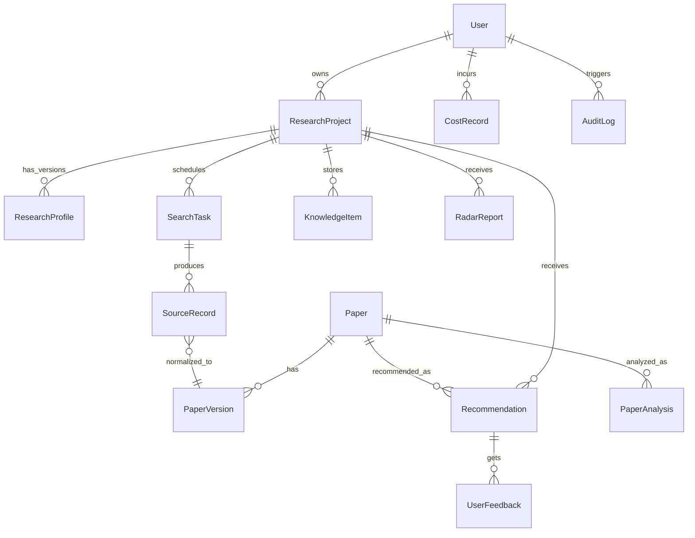
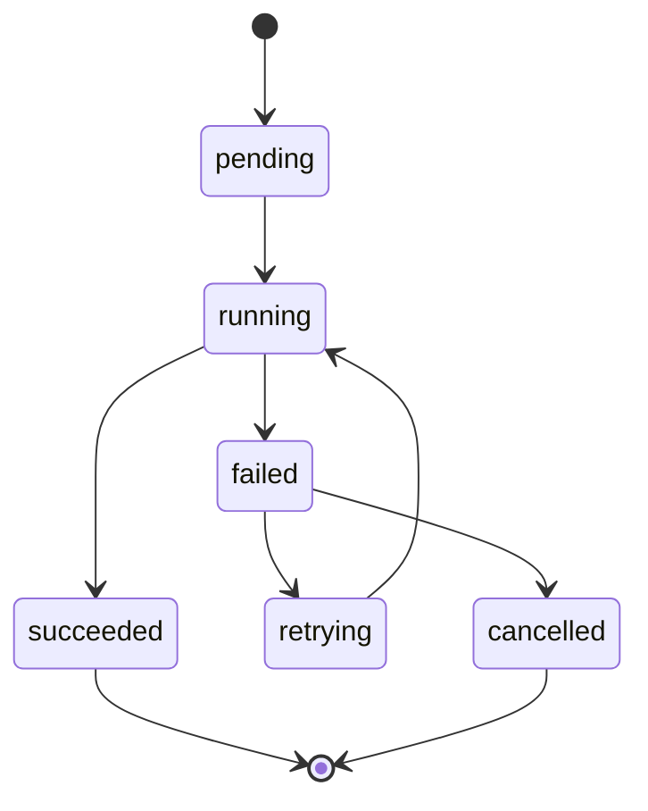
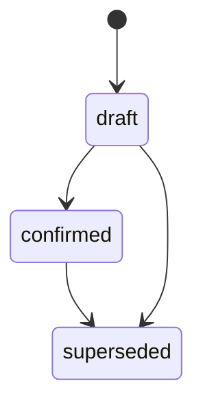

# 05 数据模型

版本：v0.1  
日期：2026-06-14  
状态：MVP 基线

## 1. 数据建模原则

1. 公共解析与个人分析分离。
2. 来源记录、文献版本和主文献实体分离。
3. 用户反馈与画像版本分离，保证推荐可追溯。
4. AI 输出必须结构化保存，不能只保存自然语言。
5. 任务、成本和审计日志必须可关联到用户、项目和功能。

## 2. 核心实体关系

## 3. 实体定义

### 3.1 User

关联需求：`RR-MVP-001`。

| 字段 | 类型 | 必填 | 说明 |
| --- | --- | --- | --- |
| id | uuid | 是 | 用户 ID |
| email | string | 是 | 登录邮箱 |
| display_name | string | 否 | 显示名称 |
| role | enum | 是 | user、admin |
| plan | enum | 是 | free、student、pro、team |
| quota_balance | integer | 是 | 研点或任务额度 |
| created_at | datetime | 是 | 创建时间 |
| disabled_at | datetime | 否 | 禁用时间 |

### 3.2 ResearchProject

关联需求：`RR-MVP-002`。

| 字段 | 类型 | 必填 | 说明 |
| --- | --- | --- | --- |
| id | uuid | 是 | 项目 ID |
| owner_id | uuid | 是 | 所属用户 |
| name | string | 是 | 项目名称 |
| discipline | string | 否 | 学科 |
| description | text | 否 | 用户描述 |
| status | enum | 是 | active、archived |
| current_profile_id | uuid | 否 | 当前画像版本 |
| created_at | datetime | 是 | 创建时间 |
| updated_at | datetime | 是 | 更新时间 |

### 3.3 ResearchProfile

关联需求：`RR-MVP-003`、`RR-MVP-006`、`RR-MVP-007`、`RR-MVP-019`。

| 字段 | 类型 | 必填 | 说明 |
| --- | --- | --- | --- |
| id | uuid | 是 | 画像 ID |
| project_id | uuid | 是 | 项目 ID |
| version | integer | 是 | 画像版本号 |
| status | enum | 是 | draft、confirmed、superseded |
| source_type | enum | 是 | one_sentence、papers、materials、feedback、manual |
| discipline | string | 否 | 学科 |
| subfield | string | 否 | 细分领域 |
| research_object | jsonb | 是 | 研究对象 |
| research_questions | jsonb | 是 | 研究问题 |
| goals | jsonb | 是 | 研究目标 |
| methods | jsonb | 是 | 方法 |
| materials | jsonb | 是 | 材料 |
| reagents | jsonb | 否 | 试剂 |
| metrics | jsonb | 否 | 性能指标 |
| mechanisms | jsonb | 否 | 机理 |
| applications | jsonb | 否 | 应用场景 |
| keywords_zh | jsonb | 是 | 中文关键词 |
| keywords_en | jsonb | 是 | 英文关键词 |
| synonyms | jsonb | 否 | 同义词和缩写 |
| exclusions | jsonb | 否 | 排除方向 |
| preferences | jsonb | 否 | 用户偏好权重 |
| confidence | numeric | 是 | 画像置信度 |
| created_at | datetime | 是 | 创建时间 |

### 3.4 Paper

关联需求：`RR-MVP-014`、`RR-MVP-016`。

| 字段 | 类型 | 必填 | 说明 |
| --- | --- | --- | --- |
| id | uuid | 是 | 主文献 ID |
| canonical_title | text | 是 | 标准标题 |
| normalized_title | text | 是 | 归一化标题 |
| doi | string | 否 | DOI |
| publication_year | integer | 否 | 出版年份 |
| journal | string | 否 | 期刊或会议 |
| abstract | text | 否 | 摘要 |
| language | string | 否 | 语言 |
| authors | jsonb | 否 | 作者 |
| keywords | jsonb | 否 | 关键词 |
| retraction_status | enum | 是 | normal、corrected、retracted、unknown |
| embedding_id | uuid | 否 | 向量 ID |
| created_at | datetime | 是 | 创建时间 |
| updated_at | datetime | 是 | 更新时间 |

### 3.5 PaperVersion

关联需求：`RR-MVP-013`、`RR-MVP-014`、`RR-MVP-015`。

| 字段 | 类型 | 必填 | 说明 |
| --- | --- | --- | --- |
| id | uuid | 是 | 文献版本 ID |
| paper_id | uuid | 是 | 主文献 ID |
| source | string | 是 | 来源名称 |
| source_record_id | uuid | 是 | 原始来源记录 |
| version_type | enum | 是 | preprint、published、early_access、author_manuscript、unknown |
| title | text | 是 | 来源标题 |
| url | text | 否 | 来源链接 |
| fulltext_url | text | 否 | 开放全文链接 |
| license | string | 否 | 许可信息 |
| published_at | date | 否 | 发布时间 |
| quality_score | numeric | 是 | 来源质量评分 |

### 3.6 SourceRecord

关联需求：`RR-MVP-010`、`RR-MVP-013`。

| 字段 | 类型 | 必填 | 说明 |
| --- | --- | --- | --- |
| id | uuid | 是 | 来源记录 ID |
| source | enum | 是 | openalex、crossref、semantic_scholar、arxiv |
| source_identifier | string | 是 | 来源内部 ID |
| search_task_id | uuid | 是 | 检索任务 |
| raw_payload | jsonb | 是 | 原始响应 |
| normalized_payload | jsonb | 否 | 标准化字段 |
| fetched_at | datetime | 是 | 获取时间 |
| quality_score | numeric | 是 | 数据质量评分 |

### 3.7 SearchTask

关联需求：`RR-MVP-009`、`RR-MVP-011`、`RR-MVP-012`。

| 字段 | 类型 | 必填 | 说明 |
| --- | --- | --- | --- |
| id | uuid | 是 | 任务 ID |
| project_id | uuid | 是 | 项目 ID |
| profile_id | uuid | 是 | 使用的画像版本 |
| task_type | enum | 是 | exact、expanded、method_transfer、citation_network、exploratory |
| query_text | text | 是 | 检索式 |
| language | enum | 是 | zh、en、mixed |
| filters | jsonb | 否 | 时间、类型、语言、全文等过滤 |
| schedule | jsonb | 否 | 定时计划 |
| status | enum | 是 | pending、running、succeeded、failed、paused |
| last_run_at | datetime | 否 | 上次执行 |
| next_run_at | datetime | 否 | 下次执行 |

### 3.8 Recommendation

关联需求：`RR-MVP-016`、`RR-MVP-017`。

| 字段 | 类型 | 必填 | 说明 |
| --- | --- | --- | --- |
| id | uuid | 是 | 推荐 ID |
| project_id | uuid | 是 | 项目 ID |
| paper_id | uuid | 是 | 文献 ID |
| profile_id | uuid | 是 | 使用的画像版本 |
| channel | enum | 是 | exact、explore、method_transfer |
| score_total | numeric | 是 | 总分 |
| score_topic | numeric | 是 | 主题相关 |
| score_method | numeric | 是 | 方法相关 |
| score_mechanism | numeric | 是 | 机理相关 |
| score_novelty | numeric | 是 | 新颖度 |
| score_quality | numeric | 是 | 证据质量 |
| score_heat | numeric | 是 | 学术热度 |
| explanation | jsonb | 是 | 推荐解释 |
| rank | integer | 是 | 排名 |
| batch_date | date | 是 | 推荐批次 |
| created_at | datetime | 是 | 创建时间 |

### 3.9 UserFeedback

关联需求：`RR-MVP-018`、`RR-MVP-019`。

| 字段 | 类型 | 必填 | 说明 |
| --- | --- | --- | --- |
| id | uuid | 是 | 反馈 ID |
| user_id | uuid | 是 | 用户 ID |
| project_id | uuid | 是 | 项目 ID |
| paper_id | uuid | 是 | 文献 ID |
| recommendation_id | uuid | 否 | 推荐 ID |
| feedback_type | enum | 是 | very_relevant、method_useful、background_citation、irrelevant、exclude_material、exclude_application、want_more、add_to_experiment、add_to_writing |
| note | text | 否 | 用户备注 |
| created_at | datetime | 是 | 创建时间 |

### 3.10 PaperAnalysis

关联需求：`RR-MVP-020`、`RR-MVP-021`、`RR-MVP-022`、`RR-MVP-035`。

| 字段 | 类型 | 必填 | 说明 |
| --- | --- | --- | --- |
| id | uuid | 是 | 分析 ID |
| paper_id | uuid | 是 | 文献 ID |
| project_id | uuid | 否 | 个性化分析所属项目 |
| analysis_type | enum | 是 | quick、standard |
| input_scope | enum | 是 | metadata、abstract、fulltext |
| language | string | 是 | 输出语言 |
| result | jsonb | 是 | 结构化分析 |
| evidence_labels_valid | boolean | 是 | 事实分级是否通过校验 |
| traceability_score | numeric | 是 | 可追溯评分 |
| model | string | 是 | 模型名称 |
| cost_record_id | uuid | 否 | 成本记录 |
| created_at | datetime | 是 | 创建时间 |

### 3.11 KnowledgeItem

关联需求：`RR-MVP-023`、`RR-MVP-024`、`RR-MVP-025`。

| 字段 | 类型 | 必填 | 说明 |
| --- | --- | --- | --- |
| id | uuid | 是 | 知识库条目 |
| user_id | uuid | 是 | 用户 ID |
| project_id | uuid | 是 | 项目 ID |
| paper_id | uuid | 是 | 文献 ID |
| status | enum | 是 | saved、read、read_later、irrelevant |
| tags | jsonb | 否 | 标签 |
| note | text | 否 | 备注 |
| created_at | datetime | 是 | 创建时间 |
| updated_at | datetime | 是 | 更新时间 |

### 3.12 CostRecord

关联需求：`RR-MVP-030`、`RR-MVP-031`、`RR-MVP-032`。

| 字段 | 类型 | 必填 | 说明 |
| --- | --- | --- | --- |
| id | uuid | 是 | 成本记录 ID |
| user_id | uuid | 是 | 用户 ID |
| project_id | uuid | 否 | 项目 ID |
| feature | string | 是 | 功能名称 |
| provider | string | 否 | 模型或数据服务商 |
| model | string | 否 | 模型名称 |
| input_tokens | integer | 否 | 输入 token |
| output_tokens | integer | 否 | 输出 token |
| api_calls | integer | 是 | API 调用次数 |
| estimated_cost | numeric | 是 | 估算成本 |
| quota_delta | integer | 是 | 研点变化 |
| task_id | uuid | 否 | 异步任务 ID |
| created_at | datetime | 是 | 创建时间 |

### 3.13 RadarReport

关联需求：`RR-MVP-026`、`RR-MVP-027`、`RR-MVP-028`、`RR-MVP-029`。

| 字段 | 类型 | 必填 | 说明 |
| --- | --- | --- | --- |
| id | uuid | 是 | 报告 ID |
| user_id | uuid | 是 | 用户 ID |
| project_id | uuid | 是 | 项目 ID |
| report_type | enum | 是 | daily、weekly |
| period_start | date | 是 | 周期开始 |
| period_end | date | 是 | 周期结束 |
| content | jsonb | 是 | 结构化报告 |
| message_status | enum | 是 | draft、published、emailed、failed |
| created_at | datetime | 是 | 创建时间 |

## 4. 状态机

### 4.1 异步任务状态

要求：

- 每次失败记录失败原因。
- 可重试任务必须记录 retry_count 和 next_retry_at。
- 超过最大重试次数后进入 failed，并允许人工重跑。

### 4.2 研究画像状态

要求：

- 推荐只能使用 confirmed 画像，首日诊断可以使用 draft 画像但必须标记。
- 每次用户纠偏生成新版本，不覆盖历史版本。

## 5. 索引要求

必须建立的查询索引：

- `users.email` 唯一索引。
- `research_projects.owner_id, status`。
- `research_profiles.project_id, version`。
- `papers.doi` 唯一或部分唯一索引。
- `papers.normalized_title`。
- `source_records.source, source_identifier` 唯一索引。
- `recommendations.project_id, batch_date, rank`。
- `user_feedback.project_id, paper_id, feedback_type`。
- `knowledge_items.user_id, project_id, status`。
- `cost_records.user_id, created_at`。

向量索引：

- 论文标题摘要 embedding。
- 研究画像 embedding。
- 用户材料片段 embedding。

