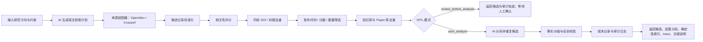

# RR-DEV-011 独立 Agent Research Scan 接口验收文档

日期：2026-06-23  
状态：已实现，待集成到工作台  
适用范围：把“研究方向 -> AI 检索规划 -> OpenAlex/Crossref 开放元数据检索 -> 筛选 -> 去重 -> 逐篇 AI 分析”的能力先做成独立接口，后续再接入项目工作台、推荐雷达或任务调度。

> 当前有效基线：默认正式数据源是 `openalex` 和 `crossref`，默认模式是 `live_api`。X-MOL/CNKI 不再作为默认自动检索来源，只保留官方/合作 API、用户授权导出或单篇公开链接导入等合规后续边界。系统不得通过浏览器 hook、隐藏接口探测、登录态复用或绕过 robots.txt 的方式获取内容。

## 1. 背景与目标

用户需要一个科研 Agent 能力：输入当前研究方向后，系统可以按来源、发布时间、评分阈值和数量限制获取候选报道/论文/文献，并与当前项目知识库去重，再对新候选执行 AI 分析。

本轮不把能力直接塞进前端工作台，而是先形成独立 API，方便后续单独测试、验收和替换数据源适配器。

目标：

1. 明确 Agent 架构、受控回路、HITL 和审计轨迹。
2. 提供独立接口 `POST /api/v1/agent/research-scan:run`。
3. 支持 OpenAlex/Crossref 官方开放元数据 API 正式接入。
4. 支持 AI 查询扩展：中文/混合语言研究方向转英文检索式、关键词和同义词。
5. 支持发布时间、最低相关分、返回数量、AI 分析数量等筛选。
6. 与当前知识库和 Paper 库去重，不重复分析已收录论文。
7. 同一轮扫描内按 DOI/标题去重，避免 OpenAlex/Crossref 返回同一篇论文导致重复。
8. 调用现有 `AiProvider.analyze_paper()`，复用事实分级、安全校验和成本记录。

## 2. 文档依据

| 文档 | 约束 |
| --- | --- |
| `docs/07-ai-and-retrieval.md` | AI 用于理解和判断，确定性系统用于执行和记录；AI 输出必须结构化、可校验、可缓存；重要结论必须事实分级。 |
| `docs/10-risk-compliance.md` | 禁止自动登录知网、保存学校账号/图书馆账号/统一认证密码、绕过机构权限下载全文。 |
| `docs/11-future-capability-backlog.md` | `RR-FUTURE-003` 中文学术数据源、`RR-FUTURE-004` 自定义来源、`RR-FUTURE-010` 后期受控 Agent。 |
| `docs/05-data-model.md` | 复用 User、ResearchProject、ResearchProfile、Paper、KnowledgeItem、CostRecord。 |
| `docs/06-api-contracts.md` | API 必须返回稳定 envelope，错误使用稳定 code。 |

## 3. Agent 架构

当前实现为受控工作流 Agent，不是无限自主 Agent。



设计原则：

- 不暴露模型隐藏思维链。
- 对外暴露 `trace`：每一步的输入数量、输出数量、状态、证据引用和简短说明。
- 对外暴露 `compliance_notes`：说明来源模式和合规限制。
- AI 负责查询扩展和逐篇文献结构化分析；篇数、循环、过滤、去重、汇总索引由后端程序控制。
- 所有逐篇 AI 分析必须走结构化 schema、事实分级和安全校验。
- 来源抓取、过滤、去重、成本记录由确定性系统完成。

## 4. HITL 设计

HITL 模式由 `hitl_mode` 控制。

| 模式 | 行为 | 适用场景 |
| --- | --- | --- |
| `auto_analyze` | 系统在筛选和去重后自动分析非重复候选。 | 官方 API 已配置、用户授权导入、用户已确认规则。 |
| `review_before_analysis` | 系统返回候选、分数、去重结果和合规说明，不执行 AI 分析。 | 接入新来源、CNKI 用户导入、需要用户确认筛选条件。 |

当 `review_before_analysis` 触发时，返回：

- `status = requires_review`
- `hitl.required = true`
- `analyses = []`
- `trace` 中包含 `hitl_gate`

后续进入前端时，应把候选列表呈现为人工审核页：用户可删除候选、修改阈值、确认授权来源，再触发分析。

## 5. 数据源策略

### 5.0 AI 查询扩展

`query_expansion` 控制研究方向到检索式的转换。

| 模式 | 行为 |
| --- | --- |
| `ai` | 默认模式。`AI_PROVIDER=openai` 时调用 OpenAI-compatible 模型生成英文查询计划；`AI_PROVIDER=mock` 时仅用于本地验收，返回通用规则计划。 |
| `rules` | 不调用 AI，按输入中的英文词和中文词生成保守查询。适用于调试或 AI 不可用时的人工验证。 |

AI 查询计划必须是 JSON object，字段包括 `mode`、`original_direction`、`translated_direction_en`、`queries`、`keywords_zh`、`keywords_en`、`synonyms_en`、`exclusions`、`confidence`、`generated_by`。

约束：

- `queries` 必须是适合 OpenAlex/Crossref 的英文检索式。
- AI 不允许决定返回篇数，篇数由 `limit` 和 `analyze_top_n` 控制。
- AI 不允许编造论文、DOI、作者或来源。
- AI 输出非法 JSON 或缺少 `queries` 时，接口返回 `AI_RETRIEVAL_PLAN_INVALID`。
- `AI_PROVIDER=openai` 且缺少 key/base/model 时，接口返回 `AI_PROVIDER_CONFIG_MISSING`，不会静默回退 mock。

### 5.1 OpenAlex

当前实现：

- 来源名：`openalex`
- 默认模式：`live_api`
- 适配器：`services/api/src/research_radar_api/retrieval/openalex.py`
- 查询方式：调用 `OpenAlexAdapter.search(query, filters, limit)`。
- 支持字段：title、authors、year、journal、doi、abstract、keywords、url、fulltext_url、open_access、citation_count、raw_payload。
- 支持 `OPENALEX_EMAIL` 礼貌访问配置。

### 5.2 Crossref

当前实现：

- 来源名：`crossref`
- 默认模式：`live_api`
- 适配器：`services/api/src/research_radar_api/retrieval/crossref.py`
- 查询方式：调用 `CrossrefAdapter.search(query, filters, limit)`。
- 支持字段：title、authors、year、journal、doi、abstract、keywords、url、license、open_access、citation_count、raw_payload。

### 5.3 X-MOL

当前边界：

- 默认 `disabled`。
- 不抓取 `/paper/search`、`/news/search` 等 robots.txt 禁止路径。
- 不通过浏览器 hook、隐藏接口探测、登录态复用或批量抓取绕过站点限制。
- 后续只允许三类方式进入系统：官方/合作 API、用户授权导出、用户粘贴单篇公开链接后做轻量元数据解析。
- 不下载全文。
- 不绕过网站限制。

后续真实接入前置条件：

1. 明确 X-MOL 可访问内容的使用边界。
2. 增加来源限流、缓存、重试和熔断。
3. 记录来源 URL、抓取时间、许可说明和原始 ID。
4. 若来源禁止自动化访问，只允许用户手动导入或官方合作接口。

### 5.4 CNKI

当前实现：

- `disabled`：默认禁用。
- `public_metadata`：直接跳过，并返回合规说明。
- `authorized_export`：只接受用户授权导出的 `external_records`。
- `official_api`：通过 `CNKI_API_BASE_URL` 调用官方/授权兼容接口的 `/search`。未配置时返回 `OFFICIAL_API_CONFIG_MISSING`，不制造假数据。

禁止：

- 自动登录知网。
- 保存学校账号、图书馆账号、统一认证密码。
- 保存长期 Cookie。
- 绕过机构权限下载全文。
- 大规模抓取商业数据库内容。

CNKI 真实接入前置条件：

1. 获得官方 API、机构合作或用户导出授权。
2. 只存储元数据、来源记录和用户授权项目内的必要信息。
3. 对全文只记录可获取性和合法链接，不默认下载和分发。

## 6. 接口设计

### 6.1 Endpoint

`POST /api/v1/agent/research-scan:run`

代码位置：

- `services/api/src/research_radar_api/main.py`
- `services/api/src/research_radar_api/agent_scan.py`

### 6.2 Request

```json
{
  "research_direction": "纳米材料 植物 生长 胁迫响应",
  "project_id": "proj_xxx",
  "sources": ["openalex", "crossref"],
  "source_modes": {
    "openalex": "live_api",
    "crossref": "live_api"
  },
  "query_expansion": "ai",
  "published_after": "2021-06-23",
  "published_before": null,
  "min_score": 8,
  "limit": 5,
  "analyze_top_n": 5,
  "analysis_type": "quick",
  "input_scope": "abstract",
  "hitl_mode": "auto_analyze",
  "external_records": []
}
```

说明：

- `limit` 控制最终候选数量。
- `analyze_top_n` 控制最多分析多少篇，不能超过筛选后的非重复候选数。
- `min_score` 使用 0 到 10 分制。
- 系统会对 `query_plan.queries` 逐条调用每个开放数据源，然后合并和去重。

### 6.3 Response

返回仍使用系统 envelope：

```json
{
  "request_id": "req_xxx",
  "data": {
    "status": "completed",
    "request_id": "agentscan_xxx",
    "candidates": [],
    "analyses": [],
    "duplicate_count": 0,
    "filtered_count": 0,
    "source_count": 0,
    "source_statuses": [],
    "query_plan": {
      "mode": "ai",
      "original_direction": "纳米材料 植物 生长 胁迫响应",
      "translated_direction_en": "nanomaterials in plant growth and stress response",
      "queries": [
        "nanomaterials plant growth",
        "nanoparticles plant stress response"
      ],
      "keywords_zh": ["纳米材料", "植物"],
      "keywords_en": ["nanomaterials", "plant"],
      "synonyms_en": ["nanoparticles"],
      "exclusions": [],
      "confidence": 0.86,
      "generated_by": "qwen3.6-plus"
    },
    "trace": [],
    "hitl": {
      "required": false,
      "mode": "auto_analyze",
      "reason": "当前为自动分析模式；重复候选不会进入 AI 分析。"
    },
    "compliance_notes": [],
    "report": null
  }
}
```

关键字段：

| 字段 | 说明 |
| --- | --- |
| `query_plan` | AI/规则生成的英文检索计划。 |
| `candidates[].matched_query` | 命中该候选的检索式。 |
| `candidates[].score` | 相关性评分，当前为规则评分，后续可替换 embedding/模型排序。 |
| `candidates[].score_basis` | 评分依据，如检索式、关键词交集、方向命中、摘要、DOI、开放全文。 |
| `candidates[].duplicate_status` | `new`、`duplicate_knowledge`、`duplicate_paper`。 |
| `candidates[].open_access` | 开放获取信号。 |
| `candidates[].fulltext_url` | 适配器发现的开放全文链接。 |
| `analyses[].paper` | 完整论文元数据快照，包括 title、authors、year、venue、DOI、abstract、keywords、source、url、fulltext_url、open_access、citation_count、合规说明。 |
| `analyses[].result.paper_metadata` | AI 分析使用的论文元数据快照。 |
| `analyses[].result.fulltext_availability` | 全文可获取性、输入范围和合法访问限制说明。 |
| `analyses[].claims` | 复用 `AnalysisClaim`，必须包含事实分级和证据。 |
| `source_statuses[]` | 每个来源的加载状态、错误码、记录数和 endpoint host。 |
| `report` | 后端确定性生成的逐篇分析索引，不调用 AI 生成综合报告。 |
| `trace[]` | 可审计步骤轨迹，不是隐藏思维链。 |
| `compliance_notes[]` | 来源模式、CNKI 限制和授权说明。 |

### 6.4 稳定错误

当 `AI_PROVIDER=openai` 且 `query_expansion=ai` 或需要自动分析，但缺少 `OPENAI_API_KEY`、`OPENAI_BASE_URL` 或 `OPENAI_MODEL` 时，返回：

```json
{
  "error": {
    "code": "AI_PROVIDER_CONFIG_MISSING",
    "message": "AI_PROVIDER=openai 时必须配置 OPENAI_API_KEY、OPENAI_BASE_URL 和 OPENAI_MODEL。"
  }
}
```

当 AI 查询计划不是合法 JSON 或缺少 `queries` 时，返回：

```json
{
  "error": {
    "code": "AI_RETRIEVAL_PLAN_INVALID",
    "message": "AI 检索规划输出无效：..."
  }
}
```

## 7. 当前代码实现

| 能力 | 文件 | 说明 |
| --- | --- | --- |
| Agent 请求/响应模型 | `services/api/src/research_radar_api/agent_scan.py` | `AgentScanRequest`、`AgentQueryPlan`、`AgentCandidate`、`AgentCandidateAnalysis` 等。 |
| Agent 主流程 | `services/api/src/research_radar_api/agent_scan.py` | `StandaloneResearchScanAgent.run()`。 |
| AI 查询扩展 | `services/api/src/research_radar_api/ai.py` | `AiProvider.generate_retrieval_plan()`。 |
| OpenAlex 正式适配 | `services/api/src/research_radar_api/retrieval/openalex.py` | 官方开放元数据 API。 |
| Crossref 正式适配 | `services/api/src/research_radar_api/retrieval/crossref.py` | 官方开放元数据 API。 |
| 同轮去重 | `services/api/src/research_radar_api/agent_scan.py` | `_dedupe_same_scan()`。 |
| X-MOL 合规边界 | `agent_scan.py` | 默认禁用；不抓取被禁止的搜索路径；后续只允许官方/合作 API、授权导出或单篇链接导入。 |
| CNKI 合规适配 | `agent_scan.py` | `official_api` 调用授权 API；`authorized_export` 接受用户导入；未授权 public metadata 跳过。 |
| 筛选 | `agent_scan.py` | 按 `published_after`、`published_before`、`min_score`、`limit`。 |
| 去重 | `agent_scan.py` | DOI 和标准化标题，对比当前知识库与 Paper 库。 |
| AI 分析 | `agent_scan.py`、`ai.py` | 对每篇非重复候选逐篇调用 `AiProvider.analyze_paper()`，复用 mock/openai-compatible。 |
| 报告索引 | `agent_scan.py` | 后端确定性生成 `AgentScanReport`，不额外调用 AI。 |
| 成本与审计 | `agent_scan.py`、`store.py` | 写入 `CostRecord`，feature 为 `agent.research_scan.{analysis_type}`。 |
| API 路由 | `services/api/src/research_radar_api/main.py` | `POST /api/v1/agent/research-scan:run`。 |
| 自动化测试 | `services/api/tests/test_agent_research_scan.py` | 覆盖开放数据源、查询扩展、筛选、去重、HITL、CNKI 合规和 AI 配置错误。 |

## 8. 验收标准

### AC-RR-DEV-011-01 OpenAlex/Crossref 默认接入

请求 `POST /api/v1/agent/research-scan:run` 后，返回 envelope 和 `AgentScanResponse`，不依赖前端工作台。默认来源是 `openalex` 和 `crossref`，默认模式是 `live_api`。

验收代码：

- `services/api/tests/test_agent_research_scan.py::test_agent_scan_openalex_crossref_analyzes_five_records_and_builds_system_report`

### AC-RR-DEV-011-02 AI 查询扩展

当 `AI_PROVIDER=openai` 且配置完整：

- 调用 `AiProvider.generate_retrieval_plan()`。
- 返回 `query_plan.mode = ai`。
- OpenAlex/Crossref 使用 `query_plan.queries` 发起检索。
- AI 不决定篇数。

验收代码：

- `test_agent_scan_openai_query_expansion_drives_open_metadata_search`

### AC-RR-DEV-011-03 支持筛选

接口必须支持：

- `published_after`
- `published_before`
- `min_score`
- `limit`
- `analyze_top_n`

候选必须先评分，再筛选，再去重，再分析。

`min_score` 使用 0 到 10 分制；为兼容旧调用，`0 < min_score <= 1` 会按比例换算到 10 分制。

### AC-RR-DEV-011-04 知识库去重

当候选 DOI 或标题已存在于当前项目知识库时：

- `duplicate_status = duplicate_knowledge`
- `duplicate_of` 指向已有 Paper
- 不进入 AI 分析

验收代码：

- `test_agent_scan_authorized_export_dedupes_against_knowledge`

### AC-RR-DEV-011-05 HITL 生效

当 `hitl_mode = review_before_analysis`：

- `status = requires_review`
- `hitl.required = true`
- `analyses = []`
- `trace` 包含 `hitl_gate`

验收代码：

- `test_agent_scan_hitl_stops_before_analysis`

### AC-RR-DEV-011-06 CNKI 合规限制

当 CNKI 使用未授权 `public_metadata` 模式：

- 不返回伪造候选。
- 不执行自动抓取。
- 返回合规说明。

验收代码：

- `test_agent_scan_blocks_cnki_without_authorized_records`

### AC-RR-DEV-011-07 AI 分析安全

AI 分析必须：

- 使用结构化 `PaperAnalysis` 兼容输出。
- claims 必须带事实分级。
- 不允许虚构 DOI。
- 不允许把推测写成原文事实。
- 写入 `CostRecord`。
- 返回完整论文元数据快照和合法全文入口，不伪造或分发受版权保护全文。
- 标准/快速分析至少包含：研究背景、研究问题、研究对象、方法、材料或数据集、实验设计、关键结果、创新点、局限、可借鉴内容、项目适配性、复现提示、风险不确定性、后续问题和深读清单。

验收代码：

- `test_agent_scan_openalex_crossref_analyzes_five_records_and_builds_system_report`
- 现有 `services/api/tests/test_ai_safety_costs.py`

### AC-RR-DEV-011-08 五篇自动分析由程序控制

当请求 `limit = 5`、`analyze_top_n = 5` 且官方 API 返回 5 条满足条件的候选：

- 后端必须通过 for-loop 对 5 篇分别调用逐篇 AI 分析。
- 不允许让 AI 决定分析几篇。
- 不允许让 AI 生成候选数量、研究方向或流程控制字段。
- `report.model = deterministic-agent-scan-report`，证明报告索引由后端确定性生成。

验收代码：

- `test_agent_scan_openalex_crossref_analyzes_five_records_and_builds_system_report`

### AC-RR-DEV-011-09 OpenAI-compatible 缺配置错误稳定

当 `AI_PROVIDER=openai` 且 `query_expansion=ai` 或需要自动分析，但 key/base/model 缺失：

- 返回 HTTP 400。
- error code 为 `AI_PROVIDER_CONFIG_MISSING`。
- 不静默回退 mock。

验收代码：

- `test_agent_scan_openai_missing_config_returns_stable_error`

## 9. 已执行验收命令

```powershell
.\.venv\Scripts\python.exe -m pytest services/api/tests/test_agent_research_scan.py
.\.venv\Scripts\python.exe -m pytest
.\.venv\Scripts\ruff.exe check services/api
$env:RUN_LIVE_RETRIEVAL_TESTS='1'; .\.venv\Scripts\python.exe -m pytest services/api/tests/test_live_retrieval.py -q
```

当前结果：

- `services/api/tests/test_agent_research_scan.py`：6 passed, 1 skipped。
- `.\.venv\Scripts\python.exe -m pytest`：26 passed, 3 skipped。
- `ruff`：All checks passed。
- live OpenAlex/Crossref retrieval smoke：1 passed。

未在 Codex 内完成：

- `$env:RUN_LIVE_AGENT_SCAN_TESTS='1'` 的独立 Agent live smoke 因当前 Codex 网络权限/用量限制未获得执行权限；该测试已加入 `services/api/tests/test_agent_research_scan.py`，默认跳过，可在本机终端手动开启。

已知非业务警告：

- pytest cache 写入 `.pytest_cache` 被当前沙箱权限拒绝。
- ruff cache 写入 `.ruff-cache` 被当前沙箱权限拒绝。

## 10. 未完成与后续任务

本轮完成的是独立 API、OpenAlex/Crossref 正式开放数据源接入、AI 查询扩展和可验收 Agent 回路，不等于 X-MOL/CNKI 真实生产接入完成。

后续任务：

1. 把 `review_before_analysis` 接入前端人工审核页面。
2. 把通过审核的候选转成正式 `SourceRecord`、`Paper`、`Recommendation`。
3. 把 Agent Scan 接入项目时间线和任务中心。
4. 增加 CNKI 导出文件解析器：RIS、BibTeX、EndNote、NoteExpress、CSV。
5. 增加 X-MOL 单篇公开链接导入器，不实现搜索页抓取。
6. 增加 Semantic Scholar、arXiv、Unpaywall。
7. 增加多研究方向人工标注集，验证评分与推荐质量。
8. 增加真实 OpenAI-compatible/Bailian live 测试开关，不在普通 CI 中消耗真实额度。
