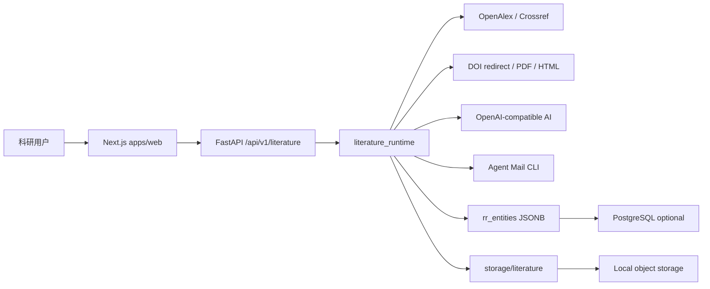
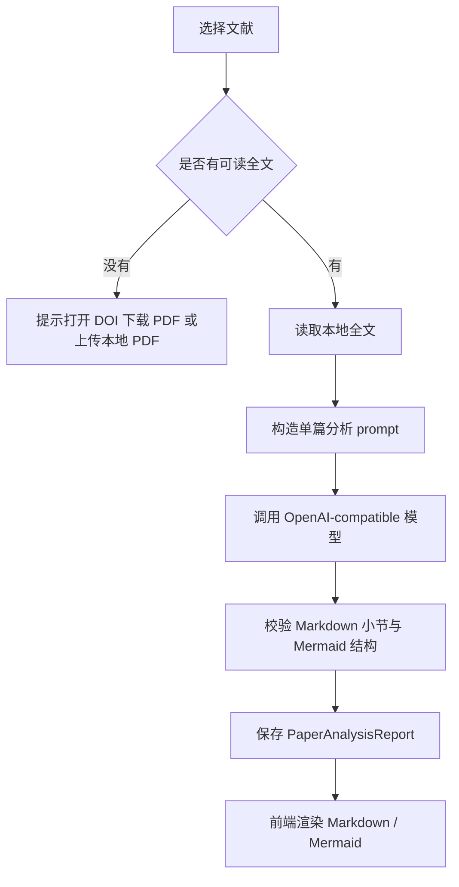

# RR-MAIN-004 项目交接与开发上手文档

版本：v0.1
日期：2026-07-01
状态：当前主产品交接基线
适用读者：新接手开发者、后续 Agent、产品验收、测试

## 1. 当前项目一句话理解

研知雷达当前已经从早期“研究项目工作台 + 推荐雷达”迁移为“文献阅读器主产品”：

```text
用户创建采集任务
-> 系统从 OpenAlex/Crossref 获取开放文献元数据
-> 评分、筛选、跨源去重、入库
-> 本地文献库用知识图谱和列表组织文献
-> 用户获取/上传 PDF 或公开 HTML 正文
-> AI 基于全文生成 Markdown 研读报告
-> 任务完成后统一推送一封任务总结邮件，附件包含全文与 AI 报告包
```

当前产品入口只看：

- 前端：`apps/web`
- 后端：`services/api`
- 主接口：`/api/v1/literature/*`
- 本地对象存储：`storage/literature/`

不要再使用：

- 旧 `apps/literature-reader` demo，已经删除。
- 旧 `4177` 端口服务。
- 旧 Phase 1 工作台作为主产品入口。

## 2. 产品板块与功能

| 板块 | 用户看到什么 | 当前能力 | 仍需完善 |
| --- | --- | --- | --- |
| 采集任务 | 新建/编辑任务表单、执行按钮、任务日志 | 支持方向、篇数、年份、评分、OpenAlex/Crossref、邮箱推送、是否 AI 分析 | 后台定时调度仍需 Redis + RQ/Celery |
| 本地文献库 | 中间知识图谱、右侧文献列表、搜索排序 | 任务/主题分组、节点定位、列表高亮、文献详情跳转 | 语义关系、实体关系和项目归类仍弱 |
| 文献详情 | 原文/PDF/Markdown、上传 PDF、获取 DOI 原文、删除文档 | PDF 优先展示；无全文时给出来源链接、上传入口和自动获取入口 | 出版商 HTML/PDF 适配还需扩展；OCR 未做 |
| AI 分析报告 | Markdown 报告、Mermaid 流程图、证据范围 | 只允许基于本地全文生成报告；摘要/元数据不生成伪报告 | Prompt 质量、证据切片、评测集仍需加强 |
| 邮箱推送 | 绑定发送邮箱、任务级填写收件人、邮件记录 | 支持任务级汇总邮件，附件打包全文 PDF/Markdown 与 AI 报告；Agent Mail 自动确认路径已接入 | sent 状态回查和失败重试体验仍需加强 |
| 浮层任务中心 | 页面右下角按钮打开任务/消息浮层 | 展示正在执行的采集、全文获取、上传、AI、邮件状态和错误 | 长期通知历史不保留，后续可做通知中心 |

## 3. 总体架构



当前实现特点：

- 前端请求统一指向 `NEXT_PUBLIC_API_BASE_URL`。
- 后端 `literature.py` 暂时仍是主路由大文件，但运行逻辑已经部分拆到 `literature_runtime/`。
- 数据库第一版使用 `rr_entities` JSONB 通用实体表；空库启动为空，不再自动导入 demo 文献。
- 文献 PDF、Markdown、报告、邮件正文等资产使用本地对象存储路径。
- PostgreSQL、S3、Redis、RQ/Celery 是正式化目标，但尚未完全落地。

## 4. 启动与验收

从 clone 到启动请先看根目录 [README.md](../README.md)。

核心启动命令：

```powershell
uv run uvicorn research_radar_api.main:app --reload --host 127.0.0.1 --port 8010 --app-dir services/api/src
```

```powershell
npm run dev:web
```

核心验收命令：

```powershell
.\.venv\Scripts\python.exe -m pytest -p no:cacheprovider
.\.venv\Scripts\ruff.exe check --no-cache services/api
npm run lint:web
npx tsc --noEmit --project apps/web/tsconfig.json
npm run build
```

## 5. 前端代码地图

| 文件 | 职责 | 接手注意 |
| --- | --- | --- |
| `apps/web/app/page.tsx` | 首页入口，加载文献阅读器 | 当前主页面，不再加载旧工作台 |
| `apps/web/components/literature-reader/literature-reader-app.tsx` | 文献阅读器主状态与编排 | 仍偏大，是下一轮组件化重点 |
| `activity-center.tsx` | 右下角浮层任务中心 | 所有提示、错误、执行中任务应进入这里 |
| `api.ts` | 前端 API client | 新接口必须先加到这里，组件不要散写 fetch |
| `library-graph.tsx` | 知识图谱 | 图谱点击/双击/分组导航逻辑集中在这里 |
| `library-paper-list-panel.tsx` | 右侧文献列表、筛选、排序 | 需要与图谱选中逻辑保持一致 |
| `mail-and-run-log.tsx` | 执行日志、邮件记录 | 避免把旧待确认记录当成当前错误 |
| `markdown.tsx` | Markdown 与 Mermaid 渲染 | AI 报告展示依赖这里 |
| `task-modal.tsx` | 新建/编辑采集任务 | 邮件收件人校验、自动化字段在这里 |
| `utils.ts` | 前端小工具 | 只放纯展示/转换工具 |

前端后续原则：

1. 页面体验以当前文献阅读器为准，不恢复旧工作台。
2. API 调用集中在 `api.ts`。
3. 组件只做展示和交互，不写后端业务规则。
4. 大文件 `literature-reader-app.tsx` 需要继续拆成 hooks 与容器组件。

## 6. 后端代码地图

| 文件 | 职责 | 接手注意 |
| --- | --- | --- |
| `services/api/src/research_radar_api/main.py` | FastAPI 应用入口，挂载路由 | 仍包含旧 Phase 1 兼容接口 |
| `literature.py` | 当前主产品 API 路由 | 下一步应拆为 tasks/library/mail/fulltext/analysis |
| `literature_runtime/retrieval.py` | OpenAlex/Crossref 检索、查询扩展、评分、去重 | 外部 503/429/500 应降级记录，不应直接崩任务 |
| `literature_runtime/fulltext.py` | DOI 跳转、PDF 下载、HTML 抽取、PDF 文本提取 | 无合法全文时必须提示上传，不伪造正文 |
| `literature_runtime/analysis.py` | AI Markdown 报告生成 | 只接受本地全文，不接受摘要级报告 |
| `literature_runtime/repository.py` | 文献库仓储、文件路径、导入数据 | 当前仍基于 rr_entities JSONB |
| `literature_runtime/models.py` | Pydantic payload / CLI 结果模型 | 新 API schema 优先放这里或拆正式 schema |
| `agent_scan.py` | 早期独立 Agent Scan 接口 | 可复用检索思想，但不是当前主入口 |
| `ai.py` | OpenAI-compatible AI client 与旧 AI 能力 | 注意不要打印 key，不要静默 mock |
| `store.py` / `schemas.py` | 旧 Phase 1 数据与 schema | 迁移前不要粗暴删除 |

后端后续原则：

1. `/api/v1/literature/*` 是当前唯一主产品 API。
2. 旧 `/api/v1/projects/*`、recommendation、profile、report 等接口先标记兼容，迁移复用后再删除。
3. 检索、全文、AI、邮件、调度必须拆分模块，不能继续堆进 `literature.py`。
4. 文献正文和 PDF 获取必须遵守版权与来源限制。

## 7. 核心数据模型

| 实体 | 含义 | 当前状态 |
| --- | --- | --- |
| `LiteratureTask` | 采集任务，包含方向、篇数、年份、评分、来源、邮箱和自动化配置 | 已实现 |
| `ScanRun` | 一次任务执行记录，包含来源状态、候选、保存、去重、降级状态 | 已实现 |
| `LiteraturePaper` | 入库文献，包含标题、DOI、年份、期刊、来源、评分、文件状态 | 已实现 |
| `PaperAsset` | PDF、Markdown、全文、AI 报告、邮件正文等本地资产 | 部分实现，仍偏路径字段 |
| `PaperAnalysisReport` | 单篇 AI Markdown 研读报告 | 已实现 |
| `MailBinding` | Agent Mail 发送账号绑定状态 | 已实现 |
| `MailDelivery` | 邮件投递记录，包含 to、subject、body_file、attachment、status；任务执行使用 `task_digest` 汇总邮件 | 已实现 |
| `TaskExecutionLog` | 采集、全文、AI、邮件等执行日志 | 部分实现，仍需更清晰事件模型 |
| `ResearchProject` | 原 PRD 的研究项目/课题容器 | 旧能力存在，尚未正式融合进文献阅读器 |

当前缺口：

- 缺正式关系型表和 Alembic 迁移。
- 缺按用户/项目隔离的数据模型。
- 图谱关系目前主要由任务和文献派生，不是真正语义知识图谱。

## 8. 主 API 文档

当前主产品接口都在 `/api/v1/literature` 下：

| 方法 | 路径 | 用途 |
| --- | --- | --- |
| `GET` | `/health` | 文献阅读器健康检查 |
| `GET` | `/library` | 获取文献库、任务、运行记录、邮件状态 |
| `POST` | `/scan` | 兼容扫描入口 |
| `GET` | `/tasks` | 获取采集任务 |
| `POST` | `/tasks` | 创建采集任务 |
| `PUT` | `/tasks/{task_id}` | 更新采集任务 |
| `DELETE` | `/tasks/{task_id}` | 删除采集任务 |
| `POST` | `/tasks/{task_id}:run` | 执行采集任务 |
| `POST` | `/analyze` | 兼容 AI 分析入口 |
| `POST` | `/papers/{paper_id}:analyze` | 对单篇文献生成 AI 报告 |
| `DELETE` | `/papers/{paper_id}` | 删除文献 |
| `POST` | `/papers/{paper_id}:fetch-fulltext` | 尝试 DOI/PDF/HTML 获取全文 |
| `POST` | `/papers/{paper_id}:upload-pdf` | 上传 PDF 并抽取文本 |
| `POST` | `/papers/{paper_id}/upload-pdf` | 上传 PDF 兼容路径 |
| `GET` | `/mail/status` | 获取 Agent Mail 状态 |
| `POST` | `/mail/auth:start` | 启动邮箱绑定 |
| `POST` | `/mail/auth:logout` | 退出邮箱绑定 |
| `GET` | `/mail/outbox` | 邮件投递记录 |
| `POST` | `/mail/test` | 测试邮件 |
| `POST` | `/mail/deliveries/{delivery_id}:confirm` | 确认发送兼容接口 |
| `POST` | `/mail/deliveries:confirm-pending` | 批量确认兼容接口，主 UI 不应突出展示 |
| `POST` | `/mail/deliveries/{delivery_id}:retry` | 重试邮件投递 |
| `GET` | `/files/{relative_path}` | 读取本地对象存储文件 |

API 行为约束：

- 无全文调用 AI 分析必须返回 `FULLTEXT_REQUIRED`，不写报告。
- OpenAlex/Crossref 单源失败记录为降级，不应抛出未捕获异常。
- 邮箱推送缺少收件人必须返回明确错误，不应把绑定邮箱当成收件人。
- Agent Mail 两阶段确认在自动化路径中由后端处理；前端不应把 `ctk_xxx` 当普通错误展示。

## 9. AI 分析流程

AI 分析必须按以下顺序：



报告应包含：

1. 文献身份与中文标题翻译。
2. 摘要完整翻译。
3. 研究主题。
4. 文献信息表。
5. 研究背景、目的、方法、结论。
6. 核心逻辑流程图。
7. 方法与实验设计。
8. 关键结果与证据。
9. 局限与不可追溯点。
10. 可借鉴点。
11. 与当前研究方向的关系。
12. 精读问题。
13. 后续检索建议。

禁止：

- 只有摘要时假装读过全文。
- 生成没有来源约束的结论。
- 重复小节和低价值套话。
- 编造 DOI、作者、期刊、实验数据。

## 10. 邮件推送流程

邮件推送分两类：

| 任务类型 | 推送内容 | Subject | Body |
| --- | --- | --- | --- |
| 未开启 AI 分析 | 任务汇总 + 全文附件包 | `[研知雷达] {任务名称或研究方向} · {执行时间}` | 任务参数、来源状态、保存/去重结果、文献列表、全文 ZIP |
| 开启 AI 分析 | 任务汇总 + 全文/报告附件包 | `[研知雷达] {任务名称或研究方向} · {执行时间}` | 任务参数、来源状态、文献列表、AI 分析状态、全文 ZIP、AI 报告 ZIP |

必填参数：

- `to`：收件人邮箱，来自任务表单或 `AGENT_MAIL_DEFAULT_RECIPIENTS`。
- `subject`：系统按任务名称/研究方向和执行时间生成。
- `body` 或 `body_file`：优先使用任务执行总结 Markdown 文件。

可选参数：

- `cc`
- `bcc`
- `attachment`，最多 3 个；全文和 AI 报告通过 ZIP 打包。

交互约束：

- 绑定邮箱只代表发送账号已授权，不代表收件人已填写。
- 未填写合法收件人时，“开启推送邮箱”应禁用或显示明确校验错误。
- 任务执行完后只生成一条 `task_digest` 邮件记录；如果自动发送失败，记录为 `failed` 或 `queued`，不能静默吞掉。

## 11. 文档地图

| 文档 | 当前意义 |
| --- | --- |
| `index.md` | 文档索引、编号规则、当前验收基线入口 |
| `01-product-requirements.md` | 原始完整 PRD，仍是长期产品愿景 |
| `02-mvp-scope.md` | 早期 MVP 范围，部分内容已被文献阅读器主线改写 |
| `03-user-flows.md` | 早期用户流程，可参考但不等于当前 UI |
| `04-architecture.md` | 原架构基线，技术栈仍有效 |
| `05-data-model.md` | 原核心数据模型，需补 Literature 模型为新基线 |
| `06-api-contracts.md` | 原 API 契约，需继续补 `/literature/*` 正式接口 |
| `07-ai-and-retrieval.md` | AI、检索、排重原则，仍有效 |
| `08-acceptance-and-tests.md` | 验收测试矩阵，需要持续加入文献阅读器测试 |
| `09-roadmap.md` | 阶段路线图，长期方向仍有效 |
| `10-risk-compliance.md` | 数据合规、版权、AI 幻觉风险，仍必须遵守 |
| `11-future-capability-backlog.md` | 未进入当前阶段的长期能力 |
| `RR-DEV-002A-report.md` 到 `RR-DEV-011-standalone-agent-research-scan.md` | 历史开发报告和阶段审计，主要用于追溯决策 |
| `RR-MAIN-001-literature-reader-migration.md` | 文献阅读器迁移主产品的正式方案 |
| `RR-MAIN-001-acceptance-report.md` | 迁移验收结果与后续动作 |
| `RR-MAIN-002-codebase-and-doc-gap-audit.md` | 当前代码清理、文档差距和功能补齐清单 |
| `RR-MAIN-004-project-handoff.md` | 当前交接文档，新开发者优先阅读 |

## 12. 当前不足与优先级

### P0：先稳住当前主产品

1. 拆分 `literature-reader-app.tsx`，把状态、API、任务、文献详情、AI 报告分成 hooks 和容器组件。
2. 拆分 `literature.py`，形成 tasks、library、retrieval、fulltext、analysis、mail 模块。
3. 完善邮件收件人校验、Agent Mail 自动确认、失败重试和 sent 状态回查。
4. 全面梳理旧 Phase 1 后端接口，标记 compatibility，逐步迁移或删除。
5. 更新 `05-data-model.md`、`06-api-contracts.md`、`08-acceptance-and-tests.md`，把 Literature 主产品写入正式文档。

### P1：让产品进入可持续使用

1. PostgreSQL 正式关系模型和迁移脚本。
2. Redis + RQ/Celery 后台调度，每日任务不依赖前端打开。
3. 更稳的 DOI/PDF/HTML 获取链路，补出版商适配和失败原因。
4. AI 报告质量评测集：全文依据、翻译质量、重复率、证据标注。
5. 项目/研究方向归类，把 `ResearchProject` 融合到文献任务和文献库。
6. 成本记录和额度 UI。

### P2：回到原 PRD 的研究雷达能力

1. 推荐与反馈闭环：有用、无关、方法迁移写回排序。
2. 日报/周报：从新增文献和 AI 报告生成研究雷达报告。
3. Semantic Scholar、arXiv 数据源。
4. Zotero/浏览器扩展/移动端。
5. 语义知识图谱：材料、方法、指标、结论、研究空白实体关系。

### P3：机构与长期能力

1. 团队/机构空间、权限、审计。
2. 中文学术数据源的正式授权接入。
3. S3 对象存储、私有部署、合规审计。
4. 受控 Agent 工作流，但不能做无限自主循环。

## 13. 开发规则

1. 先改文档，再改代码。
2. 当前主产品以 `apps/web` 文献阅读器体验为准。
3. 任何新增接口都要更新 API client、后端测试和文档。
4. 任何 AI 输出必须区分全文依据、元数据依据、AI 推测和需人工核验。
5. 任何外部来源失败都要可解释、可降级、可追溯。
6. 未授权商业数据库和学校账号能力不得绕过限制实现。
7. 邮件自动化必须明确收件人、主题、正文和附件来源。

## 14. 新 Agent 接手检查清单

1. 读 [README.md](../README.md) 完成启动。
2. 读本文件确认当前主产品边界。
3. 读 [RR-MAIN-002-codebase-and-doc-gap-audit.md](./RR-MAIN-002-codebase-and-doc-gap-audit.md) 了解未完成清单。
4. 检查 `git status`，不要覆盖用户未提交改动。
5. 运行必要测试，不要让卡住的 build 阻塞所有工作；可让用户本机补跑 build。
6. 开发时只使用 `apps/web` 和 `/api/v1/literature/*` 作为主线。
7. 验收通过后提交并推送。
